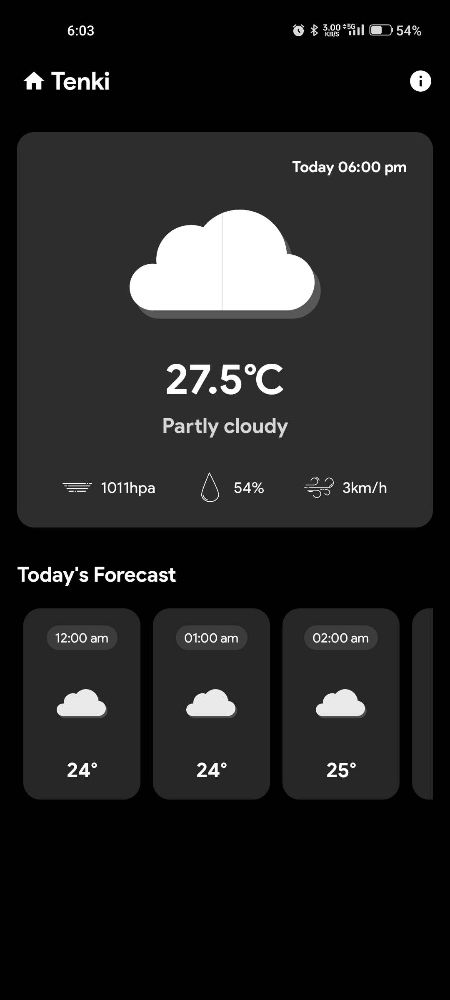
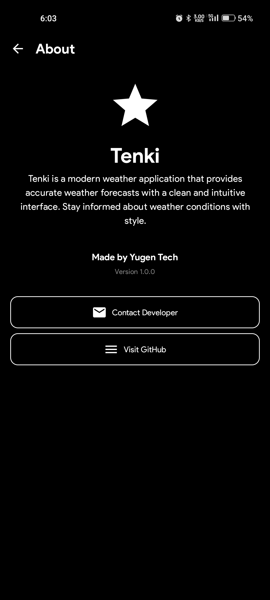

# ⛅ Tenki - Your Personal Weather Companion

Welcome to **Tenki**, a beautifully crafted weather application designed to keep you informed and prepared for any forecast. With real-time updates, elegant design, and a seamless user experience, Tenki helps you stay ahead of the weather — wherever life takes you.

---

## ✨ Features

- **Current Weather**: Get real-time weather updates for your location.
- **5-Day Forecast**: Plan ahead with detailed future weather forecasts.
- **Location Search**: Quickly search for weather conditions anywhere in the world.
- **Dynamic UI**: Weather visuals adapt based on current conditions.
- **Minimalistic & Fast**: Optimized for a smooth and responsive experience.

---

## 🎨 UI Highlights

- **Modern Design**: Clean, vibrant layouts using soft transitions and intuitive icons.
- **Dynamic Layouts**:
  - A captivating **Home Screen** showing current temperature, conditions, and more.
  - A **Forecast Screen** presenting upcoming weather trends in an elegant list.
- **Effortless Navigation**: Swiftly switch between today’s weather and weekly forecasts.

---

## 🚀 Technologies Used

- **Language**: Kotlin  
- **UI Framework**: Jetpack Compose  
- **Networking**: Retrofit with Moshi  
- **API**: OpenWeatherMap API (or your selected weather API)  
- **Architecture**: Simple, lightweight state management with Compose practices  

---

## 📸 Screenshots

<div align="center">
  




</div>

---

## 🛠️ Setup & Installation

1. **Clone the Repository**:
   ```bash
   git clone https://github.com/MohammadAliUstad/Tenki.git
   cd tenki
   ```
2. **Open in Android Studio**: Import the project and sync Gradle.  
3. **Run**: Build and run the app on an emulator or physical device.

---

## 🌟 Contributing

Contributions are welcome!  
Feel free to fork the repository, suggest improvements, and create pull requests to make Tenki even better.

---

## 📞 Contact

Have feedback, ideas, or questions? I’d love to hear from you:  
📧 **Mohammadaliustad@gmail.com**

---

**Made with 🌦️ passion to keep you weather-ready by Yugen Tech**

---
